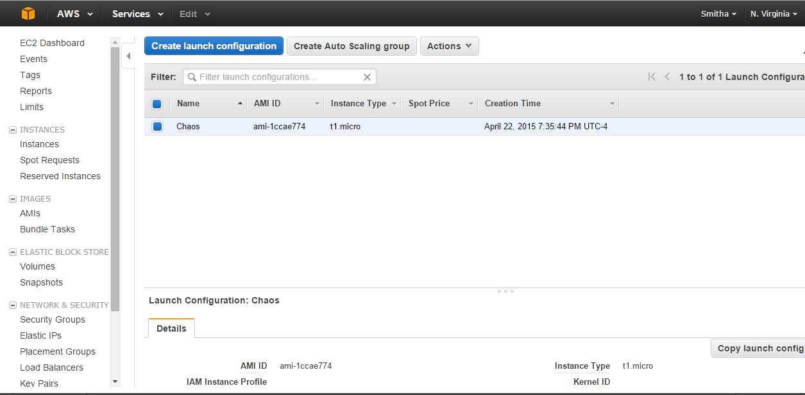
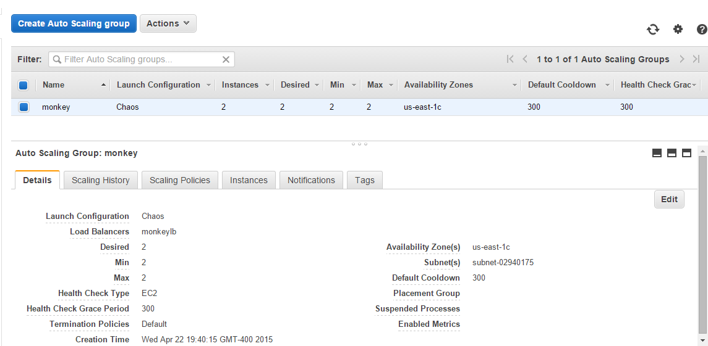
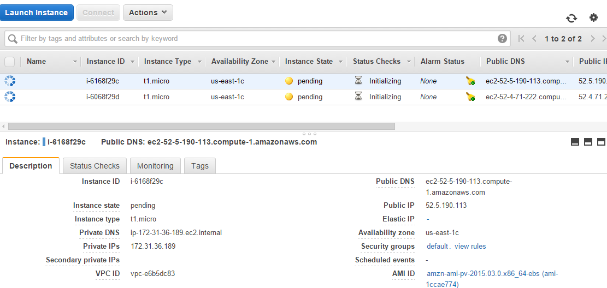
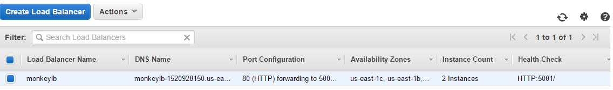
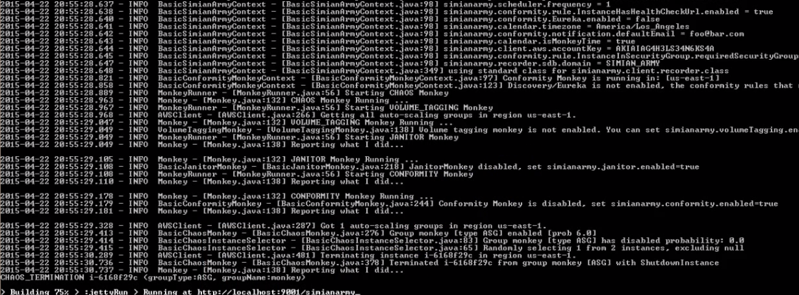
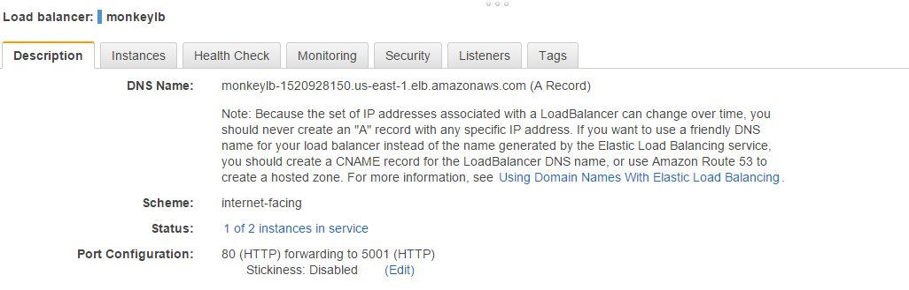
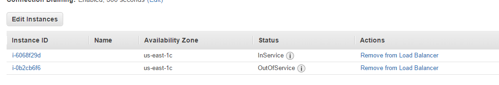
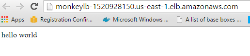
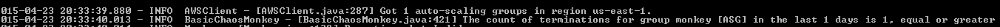

SPECIAL MILESTONE  - CSC591 DevOps
-------------------------------

Project Team Members:

1] Priyanka Shankaran (priyan)

2] Smitha Sathyanarayana (ssathya)

### Description
-------------------------------

For our special milestone, we are introducing resilience testing through the **Chaos Monkey**.We are using the **Netfilx** vesrion of Chaos Monkey and configuring the code to suit our application needs.

1] Chaos Monkey brings down EC2 instances randomly. To make our application resilient to such attacks we are creating auto scaling groups with a load balancer using Amazon Web Services(AWS).

2] To create auto scaling groups we first create a launch configuration with the AWS Management Console. This is the configuration with which the EC2 instances are created automatically.

3] We are creating Auto Scaling Groups(ASG) to rescale the architecture whenever Chaos Monkey brings a server down. In the below screenshot we can see that we are making sure that 2 instances are always up for our project.

4] As soon as we configure Auto Scaling Groups we see that two EC2 are created atomatically as seen in the screenshot below:

5] A load balancer is also created so that traffic is routed to healthy EC2 instances whenever one server is terminated by Chaos Monkey. 

6] The chaos monkey code propert files are configured so taht chaos monkey attacks our Auto Scaling Group created above. The screenshot below shows that one EC2 instance has been chosen randomly and terminated.

7] On the AWS managemnt console we can check that one instance is done. The load balancer screenshots below depict the same i.e one instance is down.

8] Using the public domain address of the load balancer we can see that no disruption has been observed in the application.

9] Chaos monkey is configured only once per day and hence if we try to run it again in the same day we get a message as shown below:

10] As soon as one instance is terminated, the auto scaling group creates another EC2 instance automatically. We can setup notifications and deploy our application to the new instance. Thus using an auto scaled,load balanced application resiliency is introduced in our infrastructure.

The video demoing our DevOps pipeline can be found here: https://www.youtube.com/watch?v=dIYWab_QRLo&feature=youtu.be&hd=1

